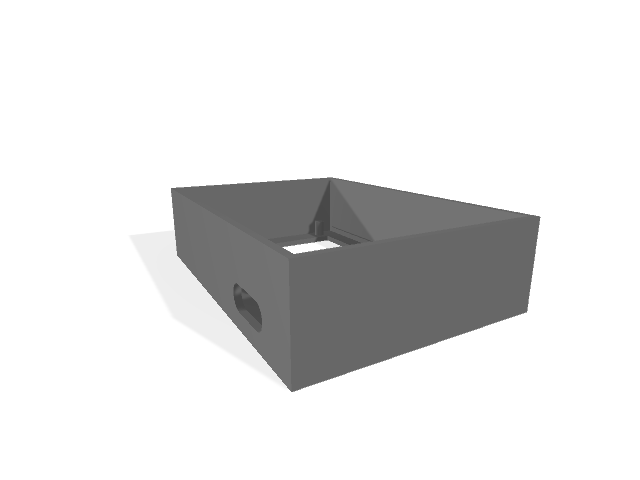
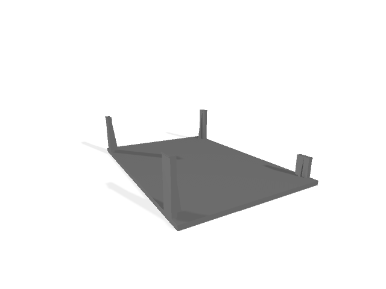

# Bongo PyCat
#### MicroPython project for ESP 32c3 mini with 0.96 OLED Display

### Install ESP Tool and Setup MicroPython
https://docs.micropython.org/en/latest/esp32/tutorial/intro.html

### Hardware parts
ESP
ESP32c3 mini

Display
0.96 inch IIC Serial 4pin OLED Display Module 128X64

TouchSensors/buttons
two
2 x single

Lipo charge/stepup module

Lipo

### Enclosure

